# bililive-go 异步生命周期导览

> **审阅基线**：`c0c7ecfc331e2386b8713ad16365a19b1406714a`（2026-07-26）  
> **文档性质**：当前代码的只读架构审计，不是理想化设计，也不代表下文列出的风险已经被用户稳定复现。  
> **目标读者**：需要快速判断“谁创建了任务、谁应当停止它、谁会等待它、事件为何会乱序”的维护者。

## 0. 如何阅读这份文档

文中使用三种标记，避免把代码事实与并发推演混在一起：

- **事实**：能直接从当前源码确认的行为。
- **可能结果**：由多个已确认行为组合后，存在的合法并发执行路径。
- **待验证**：需要测试、竞态检测或线上轨迹才能确认是否真的触发。

如果只读五分钟，请先记住下面四句话：

1. 当前程序**不是一棵完全由 `rootCtx` 托管的任务树**。
2. `Instance.WaitGroup.Wait()` **不等于所有 goroutine、文件和子进程都结束了**。
3. EventDispatcher 中，**派发顺序不等于处理顺序；事件对象也不是派发时快照**。
4. 当前 `RecorderStart`/`RecorderStop` 表示“开始/停止请求”，**不等于已经写出字节/已经完成文件收尾**。

---

## 1. 一张图建立整体心智模型

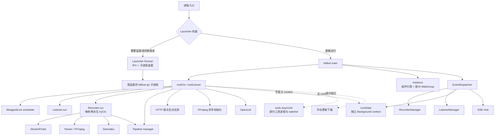

这张图最重要的不是箭头，而是三种不同线：

- 实线 `rootCtx -> child`：根取消至少能被子任务观察到；
- 虚线：任务并非从根 context 派生，必须依靠自己的 `Close`、channel 或进程退出；
- `EventDispatcher -> consumer`：这是异步通知关系，不是父子生命周期关系。

---

## 2. 当前并存的五种生命周期机制

| 机制 | 典型对象 | 能回答什么 | 不能保证什么 |
|---|---|---|---|
| `rootCtx/rootCancel` | WrappedLive、Listener、Recorder、Pipeline | “全局停止已被请求” | 子任务是否已经观察、收尾并退出 |
| `Instance.WaitGroup` | HTTP Server、ListenerManager、RecorderManager 的外壳 | 这些登记项是否调用了 `Done` | 所有内部 goroutine、parser、子进程是否退出 |
| 模块自有 `ctx/wg` | Pipeline、IOStats、StreamProbe | 该模块自己登记的任务是否完成 | 模块之外的 callback/event handler |
| 显式 `stop/done/Close` | Listener、Recorder、SSE、danmaku | 某对象是否收到停止请求 | `Close` 是否等待真实退出，取决于实现 |
| 独立 `Background` 或无 ctx | LiveState、部分工具初始化、手动下载 | 只能靠专门的 Close/进程结束 | `rootCancel` 自动结束它们 |

### 2.1 Context 与等待责任矩阵

| 子系统 | context 来源 | 主要退出信号 | 调用 `Close` 后是否等待 | 维护时应理解成 |
|---|---|---|---|---|
| WrappedLive scheduler | root 派生 | ctx + `schedulerStop` | 否 | 已请求 scheduler 停止 |
| Listener.run | app ctx 派生 `runCtx` | `runCancel` + `stop` | 否 | 已请求停止轮询 |
| Recorder.run | app ctx；每轮派生 `tryCtx` | `stop` + root | 普通 `Close` 否；`CloseForRestart` 是 | 普通关闭仍可能在文件收尾 |
| StreamProbe | `tryCtx` 派生 | cancel、连接/Server 关闭 | 仅等待自身部分任务 | 探测的同步前半段仍需单独看 |
| FFmpeg parser | 命令不是 `CommandContext` | 写 `q`，超时后 kill | `Stop` 否；`Parse` 内部 `Wait` | 最终退出由 parser goroutine观察 |
| native FLV parser | 请求未统一绑定 ctx/timeout | stop channel | 否 | 阻塞 Read 未必立刻被打断 |
| Danmaku | 各平台实现不同 | ctx、done、连接关闭 | 多数不 wait | 不同平台退出语义不一致 |
| Pipeline | root 派生 manager ctx | cancel | **是**，等待 manager wg | 当前最接近结构化关闭的模块 |
| LiveState | `context.Background()` | 自有 cancel | 否 | DB 关闭可能早于 heartbeat/handler退出 |
| HTTP Server | Serve 不由 root 自动结束 | 显式 `Shutdown` | Instance WG 先 `Done` | WG 归零不代表 Shutdown 完成 |
| SSE | HTTP request ctx + hub close | 连接断开/hub close | 由 HTTP 管理 | 无持久化、无 replay |
| AutoUpdater | root + stop channel | root/Stop | 否 | 内层网络请求不一定都绑定 ctx |
| 手动更新下载 | `context.Background()` | 当前无完整取消链 | 否 | 请求断开/关机未必立即停止 |
| tools/btools/scheduler | 部分无 root ctx | Cleanup/进程退出 | 普通关闭不统一等待 | 需要单独的进程生命周期记录 |
| klive | 收到 root ctx，但子命令非 `CommandContext` | `Manager.Stop` 才 kill | main 常规关闭未显式 Stop | root 取消与子进程结束不是同一件事 |
| OpenList | `CommandContext(root)` | root/Stop | Stop 不 wait | root 能杀进程，收尾不属于总 WG |

> **判断技巧**：看到 `cancel()` 只能得出“停止请求已发出”；看到 `Wait()` 或 `<-done` 才能进一步得出“被登记的执行体已退出”；还需要检查被等待对象内部是否又创建了未登记任务。

---

## 3. 进程启动生命周期

### 3.1 主启动序列

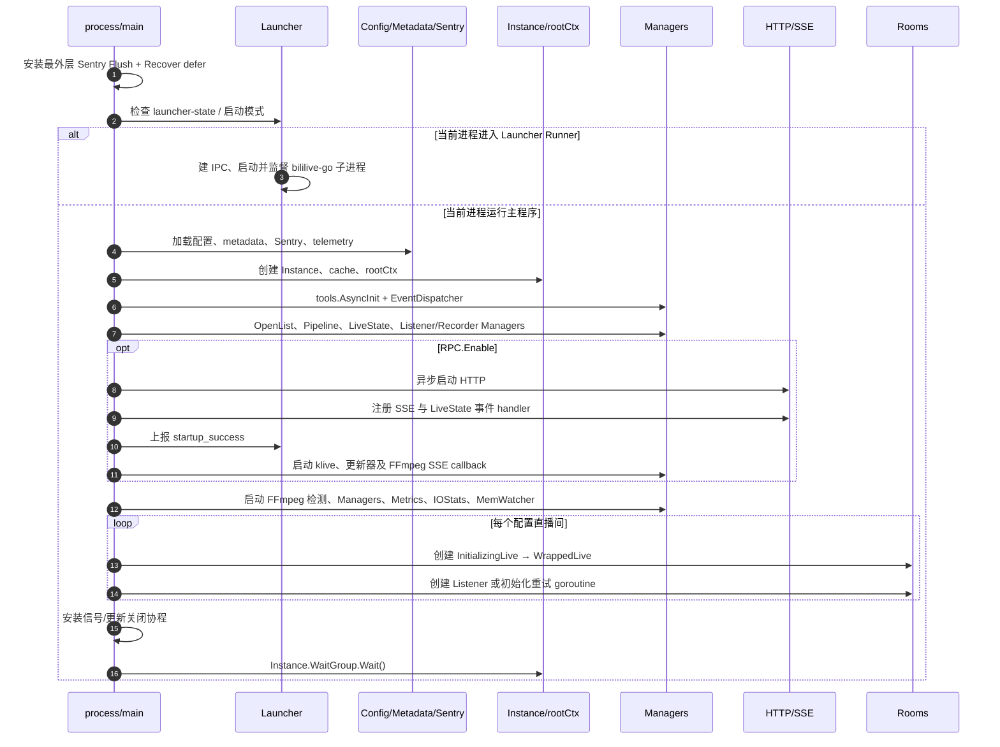

### 3.2 启动阶段容易误读的信号

| 现象 | 实际能证明 | 不能证明 |
|---|---|---|
| HTTP `Start()` 返回 nil | 启动 goroutine 已创建 | 端口已经成功 bind；`net.Listen` 在 goroutine 内发生 |
| Launcher 收到 `startup_success` | 子程序执行到了上报点 | HTTP 服务真的可连接；所有直播间已初始化 |
| Listener 派发 `ListenStart` | `Start()` 已进入 | 首次刷新成功；run goroutine已稳定运行 |
| Recorder 派发 `RecorderStart` | recorder controller 已启动 | 已取到播放地址、parser已启动、文件已有字节 |
| LiveState manager 已 `Start` | DB与heartbeat管理器已创建 | 事件 handler 一定已注册；当前注册位于 `RPC.Enable` 分支 |

### 3.3 Sentry 最外层 Recover 的边界

最外层 defer 只能覆盖**当前 goroutine 中会展开栈的 panic**。以下情况不应期待它可靠留下事件：

- 其他未包装 goroutine 的 panic；
- `log.Fatal`/`os.Exit`；
- `SIGKILL`、容器强杀、宿主机断电；
- 内核 OOM kill；
- Launcher 强制 kill；
- 进程在 Sentry flush 前被终止。

部分 goroutine 使用 `bilisentry.Go`，但仍存在弹幕 read/heartbeat、HLS probe、telemetry、部分 IPC/进程辅助逻辑等 raw goroutine。另一方面，`bilisentry.Go` 的 Recover 会吞掉 panic；这可能使进程继续运行，但长期任务已经悄悄消失。

---

## 4. EventDispatcher：最关键的并发语义

源码入口：[dispatcher.go](../../src/pkg/events/dispatcher.go)。

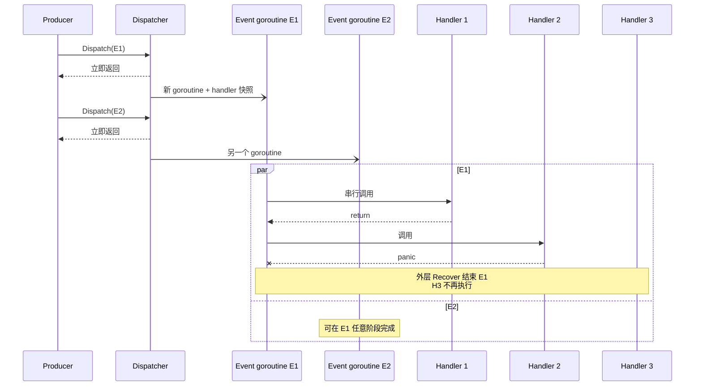

### 4.1 可以依赖的保证

- 派发时会在锁内复制该类型的 handler 列表。
- **同一个事件实例**的 handler 按快照中的注册顺序串行调用。
- 调用 `DispatchEvent` 的生产者不会同步等待 handler。

### 4.2 不存在的保证

- 不同事件之间没有 FIFO 或因果顺序保证；
- 没有 event ID、parent ID、generation、时间戳或幂等键；
- 没有队列长度、背压、完成确认、超时、context、shutdown drain 或 replay；
- `Object any` 常是可变指针，不是派发瞬间的不可变快照；
- 任一 handler panic 后，本事件剩余 handler 不再运行；
- `Close()` 当前不会阻止新派发，也不会等待已派发任务。

因此，以下代码：

```text
Dispatch(A)
Dispatch(B)
```

只能说明生产者**观察到 A 在 B 之前**，不能说明 A 的 DB 更新、Recorder 操作或 SSE 广播先于 B 完成。

### 4.3 一个容易忽略的实现细节

`RemoveAllEventListener(eventType)` 当前忽略传入的类型并清空全部事件监听器。它是独立的实现问题，不应被理解成 EventDispatcher 的设计语义。

---

## 5. 显式业务事件目录

| 事件 | 真实触发时刻 | 主要消费者 | 正确解读 |
|---|---|---|---|
| `ListenStart` | `Listener.Start()` 内，首次 `refresh()` 之前 | SSE | “请求启动监听” |
| `ListenStop` | `Listener.Close()` 内，cancel/close stop 之前 | SSE、RecorderManager | “请求停止监听” |
| `LiveStart` | Listener 观察 `false → true`；通知发送完成后 | SSE、LiveState、RecorderManager | 某次观察到开播边沿 |
| `LiveEnd` | Listener 观察 `true → false`；Recorder 也可在明确 offline 时补发 | SSE、LiveState、RecorderManager | 某个生产者观察到下播，可能重复 |
| `RoomNameChanged` | 前后均在线、名称变化且启用分段 | SSE、RecorderManager | 触发分段重启的名称边沿 |
| `RoomInitializingFinished` | InitializingLive 首次底层 `GetInfo` 成功 | SSE、LiveState、ListenerManager | 临时身份向真实对象迁移的开始 |
| `RecorderStart` | recorder run goroutine创建后立即派发 | SSE、LiveState | controller start，不是写入开始 |
| `RecorderStop` | stop关闭、parser Stop调用后立即派发 | SSE、LiveState | stop requested，不是 finalization完成 |
| `RecorderRestart` | 只有常量定义 | 无 | 当前没有 producer/consumer |
| `PipelineTaskUpdate` | 入队、开始、进度、重试/取消、终态 | SSE | 指向持续变化的 `*PipelineTask`，并非快照 |

### 5.1 不走 EventDispatcher 的“事件”

| 信号 | 传递方式 | 生命周期意义 |
|---|---|---|
| `SchedulerRefreshCompleted` | 全局 callback → SSE | 一次成功刷新完成；失败不触发 |
| FFmpeg 状态变化 | callback + close/recreate channel | checking/downloading/ready/not_found/error |
| 请求成功/失败 | WrappedLive 全局 callback → IOStats | 请求统计，不具备业务因果 ID |
| 直播间日志 | 每行 callback，随后每行再开 goroutine → SSE | 进入前端前可能已经乱序 |
| Recorder 状态 | Manager 5 秒 ticker → SSE | 周期快照，不是状态变更事件 |
| 录制结束 | callback → graceful update 检查 | 普通 Remove 时可能早于 run 真正结束 |
| 弹幕 | 各客户端 callback | SSE 与 ASS writer，平台实现不同 |
| 内存告警 | MemWatcher callback | 默认低频趋势告警 |
| 更新状态 | AutoUpdater callback | available/downloading/ready/error |
| Launcher IPC | 跨进程 channel/socket | startup、shutdown、heartbeat 等 |

---

## 6. 直播间从“未知”到“持续刷新”

### 6.1 InitializingLive

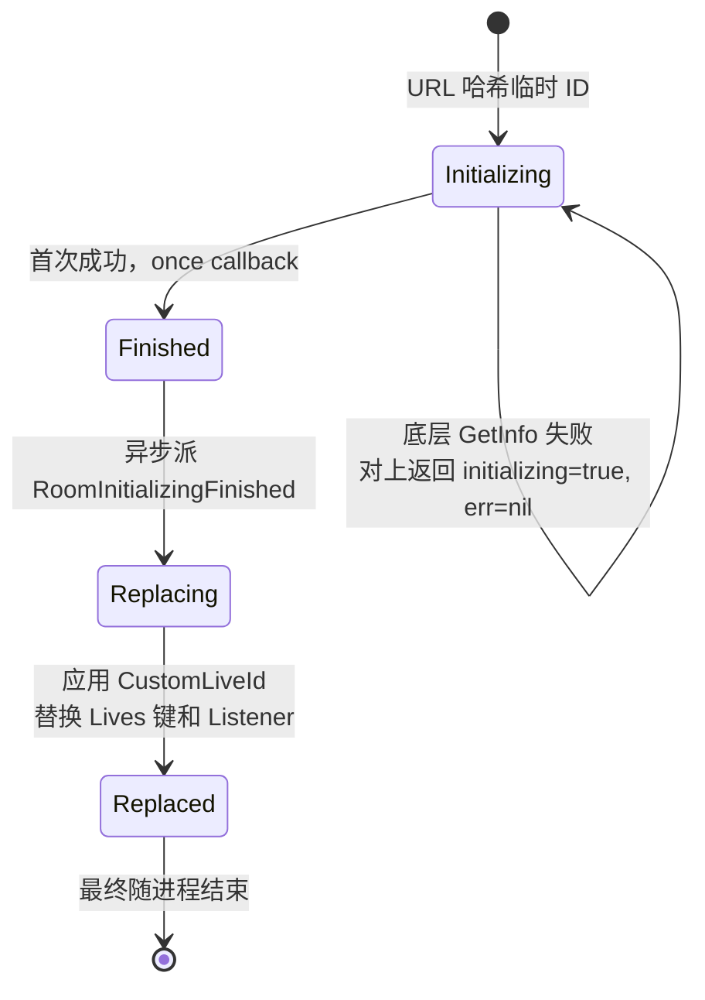

关键事实：

- 初始化失败会被包装成一个合法的 `Initializing=true` 信息，上层不一定看到 error；
- 首次成功 callback 会派发 `RoomInitializingFinished`；
- 同一次旧 Listener 的刷新还会继续执行 `processInfo`，若真实状态在线，又可能派发 `LiveStart`；
- 替换逻辑与 `LiveStart` 位于不同事件 goroutine。

这也是未来业务轨迹必须保留 `underlying_error`、临时 ID、最终 ID 和 `object_generation` 的原因。

### 6.2 WrappedLive scheduler

其目标是把同一平台/房间附近的多个刷新等待者合并成一次请求：

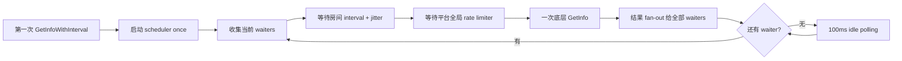

注意：

- 直接调用 `GetInfo()` 不经过 waiter 合并，可与 scheduler 请求重叠；
- `lastRequestAt` 只在成功时更新，连续失败的节奏与成功路径不同；
- `schedulerStarted` 退出后不会复位；
- `Close()` 只发送停止信号，不等待 goroutine；
- 删除房间或初始化替换旧 wrapper 时，当前路径并不总会显式调用旧 wrapper 的 `Close()`。

---

## 7. Listener 生命周期

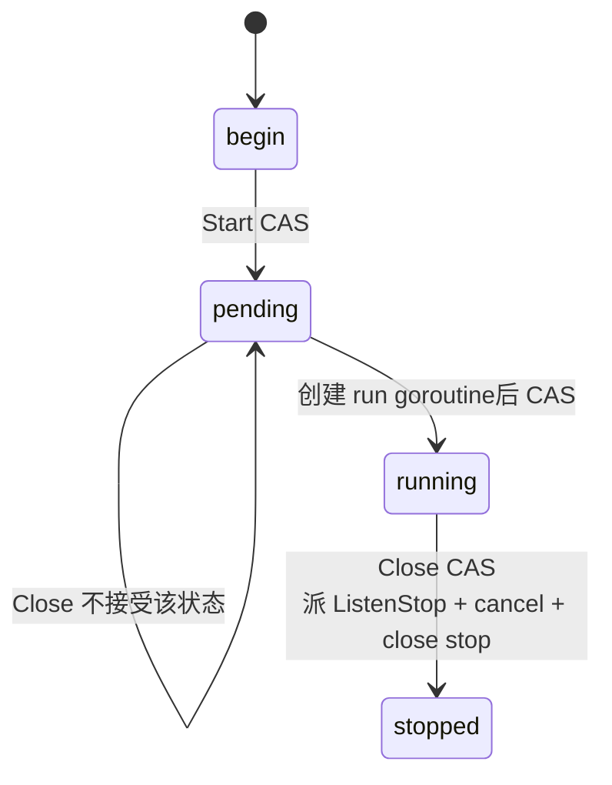

### 7.1 一次刷新做了什么

1. 通过 WrappedLive 取得 `Info`；
2. 与上一次状态比较；
3. 同步发送通知；
4. 根据差分异步派发事件；
5. 最后更新 Listener 内部状态。

边沿规则：

- `offline → live`：`LiveStart`；
- `live → offline`：`LiveEnd`；
- `live → live` 且名称变化并启用分段：`RoomNameChanged`。

### 7.2 “停止监听”并非完成屏障

`Listener.Close()`：

- 只有在 `running` 状态才接受；
- 会 cancel 并关闭 stop；
- 不等待 run goroutine退出；
- 会先派发 `ListenStop`，其消费者又是异步执行。

所以维护时应区分：

```text
close_requested → close_accepted/ignored → run_observed_cancel → run_exited
```

当前日志通常只覆盖其中一部分。

---

## 8. Recorder 生命周期：控制器、尝试和文件是三层对象

### 8.1 外层控制器状态

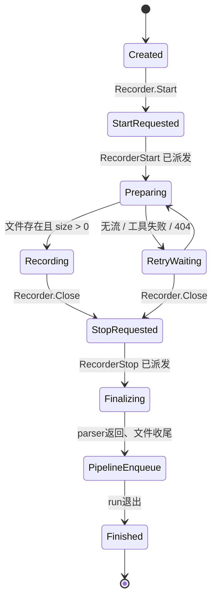

当前显式事件只覆盖：

- `RecorderStart ≈ StartRequested/Preparing`
- `RecorderStop ≈ StopRequested`

而真正定位问题通常需要的 `stream_resolved`、`probe_finished`、`parser_started`、`first_byte_written`、`segment_finalized`、`pipeline_enqueued` 和 `run_exited` 尚未形成统一事件。

### 8.2 一次录制尝试

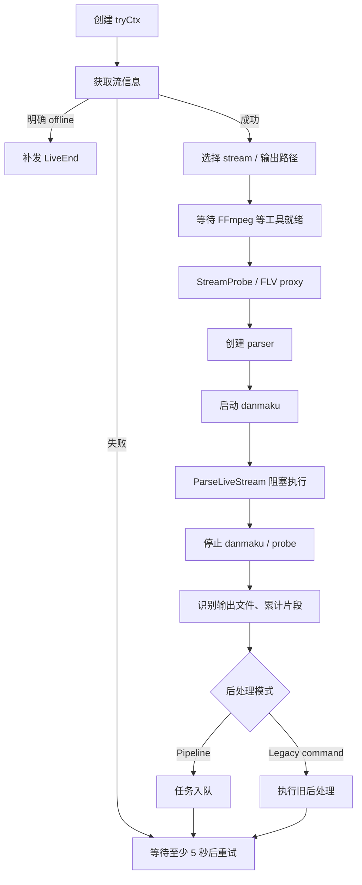

### 8.3 Restart 与 Remove

- `Restart` 在 manager 锁内用新 Recorder 替换旧 Recorder；
- 锁外调用旧 Recorder 的 `CloseForRestart()` 并等待旧 run 的 `done`；
- 旧文件收尾后，只有当新 Recorder 仍是 map 中当前实例，才把历史文件传给它；
- 同时发生的 `LiveEnd` 可先删除新 Recorder，使旧文件传递被跳过。

定时分段使用递归 `time.AfterFunc` 链，timer 未形成统一可取消的 owner 记录。多次 restart 后，需要用真实轨迹确认是否会保留多条活动定时链。

---

## 9. Pipeline 生命周期

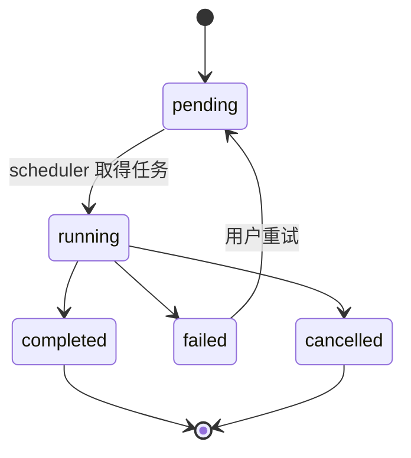

### 9.1 执行模型

- 顶层 stage 按配置顺序串行；
- parallel group 内的子 stage 并行；
- Manager 有自己的 cancel 和 WaitGroup；
- `Close()` 会 cancel、停止 poll、等待已登记任务，然后关闭 store；
- 某个 stage 若不响应 context，`Close()` 仍可能被拖住。

### 9.2 崩溃恢复语义

启动时，DB 中遗留的 `running` 会被重置为 `pending`，然后重新遍历流水线配置。这不是“从中断指令精确续跑”，对上传、自定义命令等非幂等阶段可能造成重复副作用。

当前还应注意：

- task 没有独立 attempt ID；
- 多次 `PipelineTaskUpdate` 携带同一个可变指针；
- shutdown 后最终持久化若使用已取消 manager ctx，取消状态可能未写入；
- `StageResult.StartedAt` 当前在 stage 执行返回后才赋值，不能作为可信耗时起点；
- 多个 scheduler tick 并发调度时，并发上限的预留不是一个完整原子操作，是否超限应通过测试与轨迹验证。

---

## 10. LiveState、HTTP/SSE 与已有指标

### 10.1 LiveState

LiveState 保存直播间、直播会话、录制标志与 5 秒 heartbeat，并在下次启动时把仍标记为 recording 的会话判定为 crash interruption。

必须理解其当前语义边界：

- 使用独立 `context.Background()`，不自动继承 root cancel；
- `Close()` 不等待 heartbeat goroutine后再关 DB；
- EventDispatcher 也不 drain，关闭时可能仍有 handler 写 DB；
- `RecorderStart` 早于真正写文件，`RecorderStop` 早于文件完成；
- `RegisterEventListeners` 当前位于 `RPC.Enable` 分支；关闭 WebUI 时，manager虽启动，业务事件并不会按同一路径写入；
- 初始化使用 CustomLiveId 时，LiveState handler 可能先按旧临时 ID 写入，ListenerManager handler随后才完成身份替换。

因此 `is_recording=true` 更接近“Recorder controller 已收到启动事件”，不是强保证“磁盘上正在持续增长”。

### 10.2 SSE

每个客户端 channel 缓冲 100 条：

- 普通 Broadcast 满时静默丢新消息；
- Critical Broadcast 会尝试丢最旧消息再写入，但仍不是持久可靠队列；
- 没有 SSE `id`、`Last-Event-ID`、replay 或丢包计数；
- 重连时只补 FFmpeg 当前状态，其余依赖前端重新拉取；
- live update 时间戳目前只有秒级；
-直播间日志 callback 每行另开 goroutine，进入 SSE 前已可能乱序。

WebUI 显示顺序因此不能作为业务真实因果顺序的证据。

### 10.3 已有指标

现有 IOStats、Metrics 与 MemWatcher 已经能提供：

- 网络/录制写入速率；
- 磁盘 IO；
- Go 与容器内存；
- GC 次数；
- goroutine 数；
- 请求成功/失败统计。

这些数据有诊断价值，但当前缺少统一 `run_id/task_id/event_id` 与单调时钟，难以直接回答“这根指标尖峰对应哪次录制尝试、哪个 parser 和哪次取消”。

---

## 11. 外部进程、工具和 Launcher

| 对象 | 启动方式 | 当前停止方式 | 目前最缺的证据 |
|---|---|---|---|
| Recorder FFmpeg | `exec.Command` | 写 `q`，3 秒后 kill | pid、exit code/signal、kill cause、stderr tail |
| BililiveRecorder CLI | `exec.Command` | 写 `q` | 同上 |
| Pipeline command | 多数 `CommandContext` | task/root cancel | 统一的进程事件与完整 attempt |
| klive | 子命令非 `CommandContext` | `Manager.Stop` kill | 常规关机是否调用 Stop、真实 exit cause |
| OpenList | `CommandContext(root)` | root/Stop | Wait 完成时刻与 exit cause |
| Launcher 管理的主程序 | `CommandContext` | IPC shutdown、超时 kill | 当前 Wait error/exit code/signal未形成可靠记录 |

### 11.1 Launcher 简化状态机

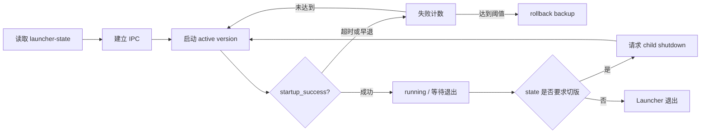

当前值得重点验证的边界：

- child 收到 Launcher IPC shutdown 时，callback 当前只 ACK + `rootCancel()`，没有进入与 SIGTERM 相同的完整模块 Close 序列；
- parent 等待约定时限后可能 kill child；
- child 退出的 `Wait()` error 没有被完整保留，异常退出可能被误标成正常；
- 极快 `startup_success` 与 `startupCh` 初始化存在竞态窗口；
- RPC 关闭路径并不按同一路径上报 startup success。

---

## 12. 事件相交案例

以下均是**允许出现的执行路径推演**。它们的价值在于说明未来轨迹需要记录什么，不表示已稳定复现。

### 12.1 案例 A：初始化第一次请求就发现正在直播

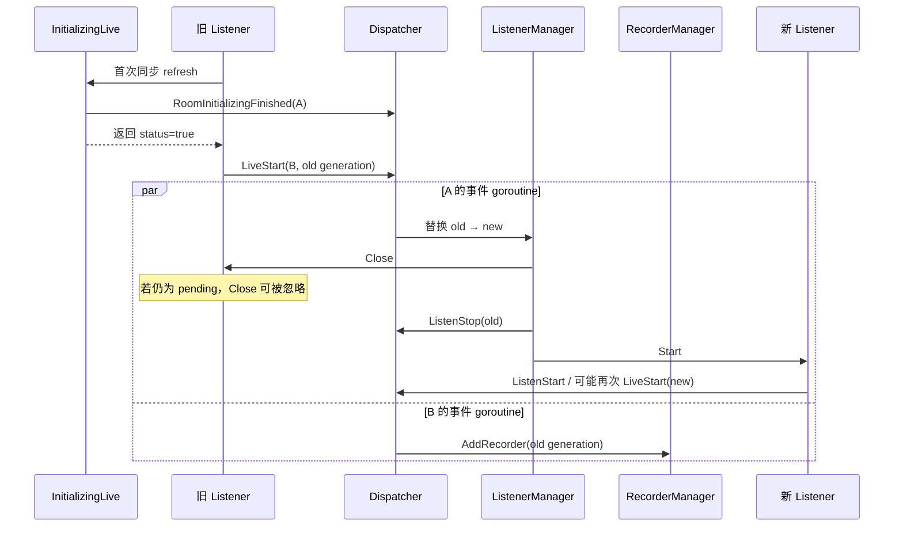

**可能结果**：

- 旧 Listener 的 Close 在 `pending` 状态不生效；
- 旧/新 Listener 同时轮询；
- `ListenStop(old)` 先执行时尚无 recorder，随后迟到的 `LiveStart(old)` 又创建一个已从 Lives 隐藏的 recorder；
- CustomLiveId 在不同 handler 中生效时刻不同，DB可能出现临时 ID 与最终 ID 两套身份。

需要的轨迹证据：`object_generation`、`old_id/new_id`、`close_accepted`、handler 起止顺序、Recorder owner。

### 12.2 案例 B：快速开播、关播、再开播

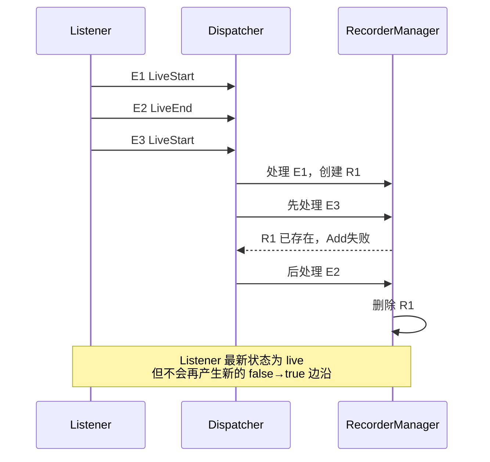

**可能结果**：最终房间在线但没有 Recorder；LiveState 中 Start/Stop handler也可能以另一顺序落库。

### 12.3 案例 C：名称分段 Restart 与 LiveEnd 相交

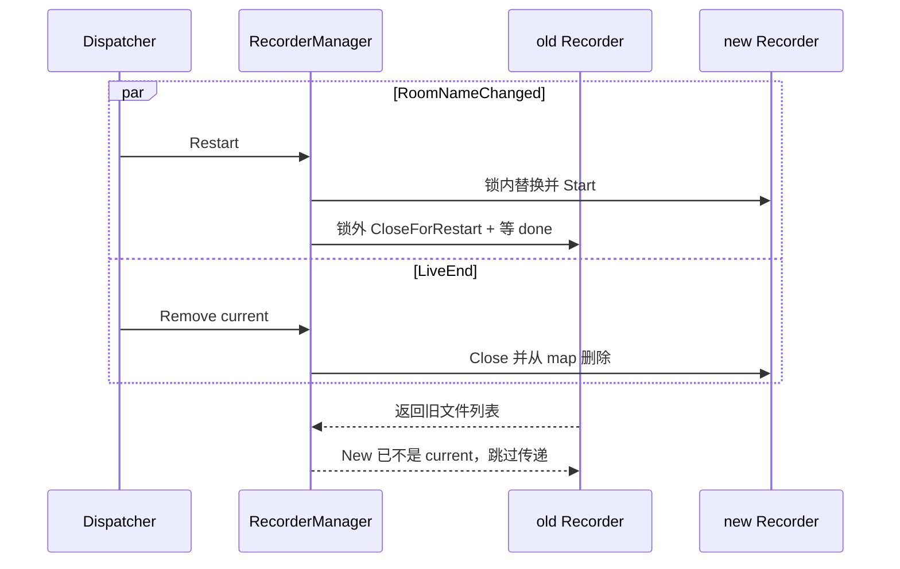

**可能结果**：新 Recorder刚启动就停止，旧文件汇总链被截断；Start/Stop 落库终态仍取决于 handler 调度顺序。

### 12.4 案例 D：正常关闭与后台收尾相交

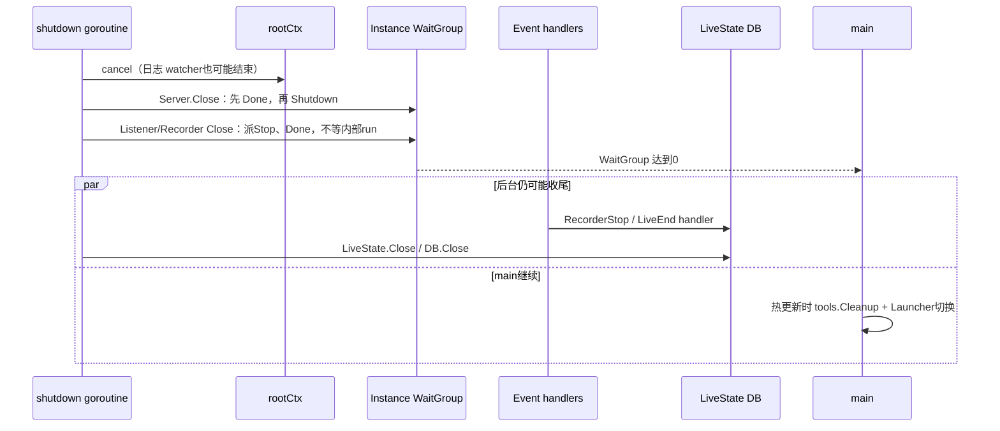

**可能结果**：事件仍写已关闭 DB、parser仍在收尾、关键 shutdown 日志文件已停止写入，或切版早于文件与子进程真实退出。

---

## 13. 极端场景速查表

| 场景 | 当前可能表现 | 普通 debug log 为什么不够 |
|---|---|---|
| raw goroutine panic | 整个进程突然退出 | 主 goroutine Recover看不到；Sentry可能来不及上传 |
| `bilisentry.Go` 内 panic | 进程继续，但某长期任务消失 | panic被吞，缺少 `task_exited_unexpectedly` 与 owner |
| SIGKILL/OOM | 没有 defer、没有最后日志 | 只能靠前一窗口黑盒、Launcher/容器退出证据 |
| SSE 慢客户端 | 页面少更新或顺序异常 | 丢包静默，没有 dropped 计数和 replay |
| native parser阻塞 Read | 关闭后仍不结束 | stop channel不等于网络 Read 已被打断 |
| Pipeline stage不响应 ctx | shutdown 卡住 | 只有开始日志，无法看当前栈/阻塞原因 |
| 迟到 LiveStart | 关闭/删除后又出现 recorder | 现有事件无 generation 与 manager closed 状态 |
| Launcher 请求切版 | child超时后被 kill | IPC shutdown与SIGTERM并非同一关闭路径 |
| 日志 writer 随 root cancel结束 | 文件缺最关键结尾 | 后续 shutdown 日志可能只剩 stderr |

---

## 14. 当前最值得优先验证的架构风险

这是一份审计优先级，不是已确认 bug 清单。

### P0/P1：影响进程退出、录制正确性或状态可信度

1. Launcher IPC shutdown 只取消 root，没有进入完整 manager Close 序列。
2. 初始化替换发生在 Listener `pending` 窗口时，旧 Listener Close 可能无效。
3. EventDispatcher 跨事件无顺序，可能造成关闭/删除之后的迟到 LiveStart。
4. Recorder普通 Close 不等待 run，文件完成与切版判断可能相交。
5. LiveState独立 ctx、Close不等 heartbeat，Dispatcher不 drain。
6. Instance WaitGroup 只覆盖少数模块外壳，不能作为“全部资源结束”的屏障。
7. raw danmaku等 goroutine panic 可能直接导致无 Sentry 的进程崩溃。

### P1/P2：影响诊断、持久化或边界稳定性

1. SSE 无事件 ID/replay，缓冲满后静默丢失。
2. Pipeline task event使用可变指针，阶段耗时起点不可信。
3. Pipeline恢复会重跑整条配置，非幂等 stage可能重复副作用。
4. 定时 Restart 链的 timer缺少统一 owner/cancel记录。
5. Launcher缺少可靠 exit code/signal/stderr tail。
6. 更新下载与部分工具初始化未形成完整 root 取消链。
7. 旧 WrappedLive在替换/删除时未统一 Close。

---

## 15. 用源码继续追踪

| 主题 | 入口 |
|---|---|
| 总启动与关闭 | [src/cmd/bililive/bililive.go](../../src/cmd/bililive/bililive.go) |
| Instance / LiveMap | [src/instance](../../src/instance) |
| 事件 | [src/pkg/events](../../src/pkg/events) |
| Live 初始化与调度 | [src/live/lives.go](../../src/live/lives.go)、[src/live/system/initializing_live.go](../../src/live/system/initializing_live.go) |
| Listener | [src/listeners](../../src/listeners) |
| Recorder | [src/recorders](../../src/recorders) |
| Parser / StreamProbe | [src/pkg/parser](../../src/pkg/parser)、[src/pkg/streamprobe](../../src/pkg/streamprobe) |
| Danmaku | [src/recorders/danmaku](../../src/recorders/danmaku) |
| Pipeline | [src/pipeline](../../src/pipeline) |
| LiveState | [src/livestate](../../src/livestate) |
| HTTP / SSE | [src/servers](../../src/servers) |
| 工具进程 | [src/tools/tools.go](../../src/tools/tools.go)、[src/pkg/kliveproxy](../../src/pkg/kliveproxy)、[src/pkg/openlist](../../src/pkg/openlist) |
| Launcher / IPC / Update | [src/pkg/launcher](../../src/pkg/launcher)、[src/pkg/ipc](../../src/pkg/ipc)、[src/pkg/update](../../src/pkg/update) |
| 日志 / Sentry | [src/log](../../src/log)、[src/pkg/sentry](../../src/pkg/sentry) |

---

## 16. 维护者排查问题时的六问

遇到“程序还活着但功能不工作”时，不要先问“最后一条错误是什么”，先问：

1. 这个对象的 **owner** 是谁，当前是第几代 `generation`？
2. 它只是收到 `cancel/Close`，还是执行体已经 `exited`？
3. 事件只是 `dispatched`，还是目标 handler 已 `finished`？
4. 页面显示的是事实快照，还是可能丢失/乱序的 SSE 增量？
5. Recorder 是 controller存在，还是 parser正在写、文件真的增长？
6. 主进程、Launcher和外部子进程分别以什么 exit code/signal结束？

下一篇文档 [《结构化业务轨迹与 Go Flight Recorder 方案》](structured-tracing-and-flight-recorder.md) 将把这六问转换成具体事件字段、黑盒触发器和 Viewer 页面。
