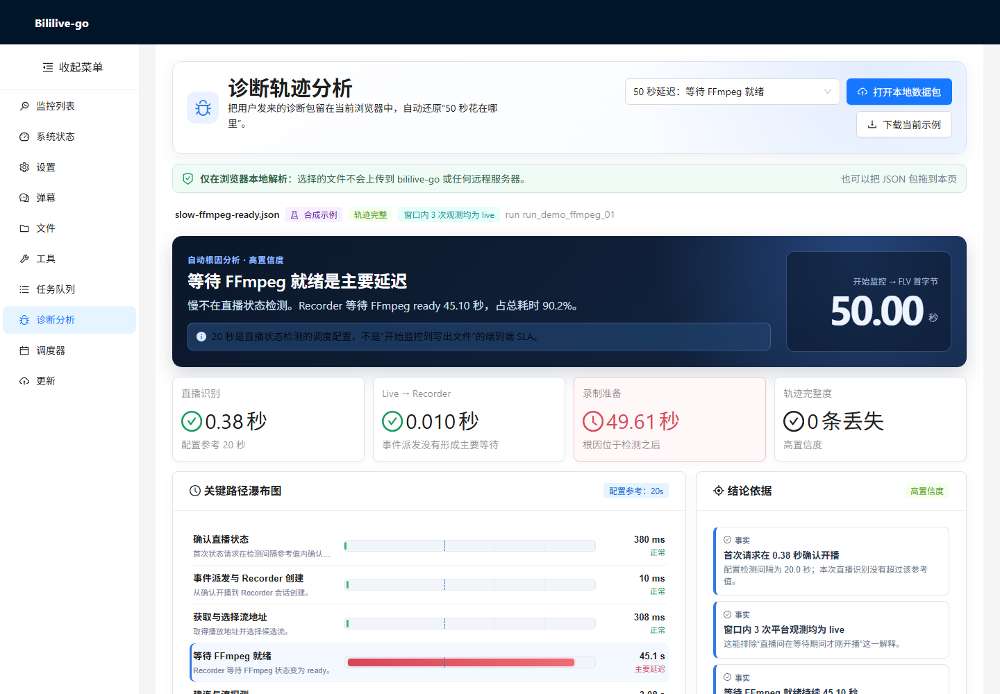
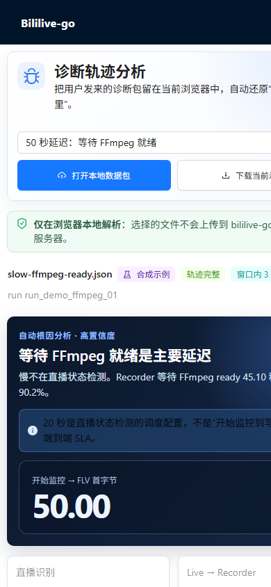
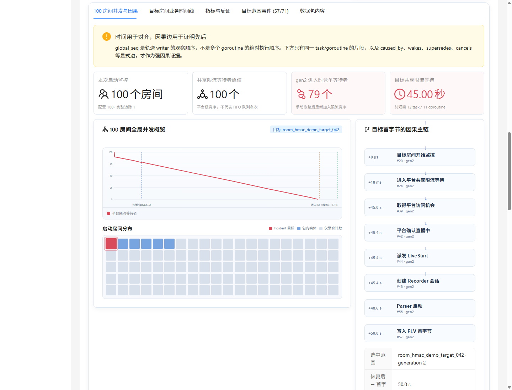
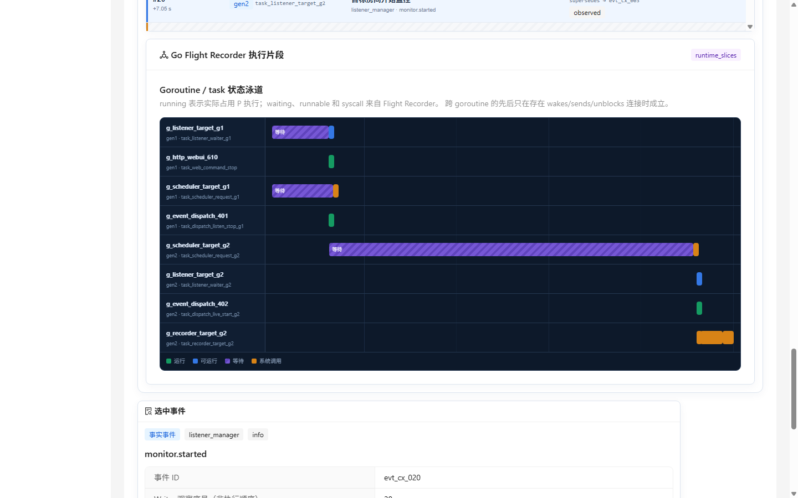

# 诊断轨迹 WebUI

> 当前实现位于现有 React WebUI 的 `/#/diagnostics` 路由。  
> bililive-go 现在会自动产生持久化轨迹；页面既能调查本机当前/历史运行，也保留
> 合成包用于评审诊断规则和移动端体验。

## 功能

- 列出本机 `AppDataPath/diagnostics/runs` 中的当前和历史运行；
- 下一次启动时提示上一运行缺少 clean marker，并可直接进入调查；
- 冻结当前 Flight Recorder、下载稳定 `.tar.gz` 调查包和原始 `.trace`；
- 在浏览器本地打开 JSON、ZIP 或 `.tar.gz` 调查包（只解出 viewer/bundle JSON）；
- 不把用户选择的文件上传到 bililive-go 或远程服务器；
- 自动计算：
  - 开始监控 → 首次确认直播；
  - LiveStart → Recorder 创建；
  - 录制准备；
  - 开始监控 → FLV 首字节；
- 配对业务 span，识别最长关键路径；
- 区分事实、运行时佐证、自动推断、排除项和证据缺失；
- 提供关键路径瀑布图、业务/runtime 泳道、指标曲线和原始事件；
- 对多房间包先按稳定房间范围、`flow_id` 和 `generation` 隔离关键路径，避免把不同房间的里程碑拼成伪结论；
- 对 100 房间启动场景提供：
  - 平台共享限流等待者、检测并发、Recorder 活跃数等聚合曲线；
  - 目标 generation 的因果主链；
  - 旧 generation 取消后迟到但被丢弃的并发旁支；
  - task / goroutine / dispatch / handler 的 writer 观察顺序；
  - 已转换数据包中的 `running`、`runnable`、`waiting`、`syscall` 连续片段；
- 支持桌面与局域网手机浏览器；
- 内置四种合成数据包，其中复杂主示例包含 100 房间并发、手动停启和多 generation 交错。

## 本机诊断 API

| 方法 | 路径 | 用途 |
|---|---|---|
| GET | `/api/diagnostics/runs` | 列出运行，不返回服务端绝对路径 |
| GET | `/api/diagnostics/startup-status` | 查看上一运行异常提示 |
| POST | `/api/diagnostics/startup-status/{runID}/ack` | 仅确认提示，不删除证据 |
| POST | `/api/diagnostics/runs/{runID}/snapshot` | 同步事件并冻结当前 Flight |
| GET | `/api/diagnostics/runs/{runID}/viewer` | 读取稳定 Viewer JSON |
| GET | `/api/diagnostics/runs/{runID}/download` | 完整下载稳定调查包 |
| GET | `/api/diagnostics/runs/{runID}/flight-recorder` | 下载稳定 `.trace` 副本 |
| GET | `/api/diagnostics/logs/download` | flush 后下载最近文本日志的固定尾部快照 |

下载端点不直接暴露仍在增长的 JSONL 或 trace，而是先创建不可变临时副本，再用
固定长度响应发送；响应结束后删除临时导出文件。当前明确返回
`Accept-Ranges: none`：每次请求的当前运行边界可能不同，禁止把来自两个冻结时刻的
Range 片段误拼为一个文件。以后只有在引入带 TTL 的不可变 export ID 后才开放断点续传。
这些即时构建型下载接口对 `HEAD` 明确返回 `405`，避免仅为计算
`Content-Length` 就执行一次完整 JSON 序列化或 gzip。
文本日志快照默认最多包含最近 3 个 bililive-go 日志、每个文件最后 8 MiB，并在
`manifest.json` 标明源大小和是否截断；不会把服务端日志目录绝对路径写入包内。

## 实际界面

### 桌面



### 手机



### 100 房间并发与多线程轨迹





## 四个测试包

| 文件 | 首次确认直播 | 主要延迟 |
|---|---:|---|
| [complex-100-rooms-manual-restart.json](samples/complex-100-rooms-manual-restart.json) | generation 2 恢复后 45.40 秒 | 100 房间共享平台限流器；恢复后的检测任务重新加入竞争并等待 45 秒 |
| [slow-ffmpeg-ready.json](samples/slow-ffmpeg-ready.json) | 0.38 秒 | 等待 FFmpeg 下载、校验并进入 ready，共 45.1 秒 |
| [slow-live-api-rate-limit.json](samples/slow-live-api-rate-limit.json) | 约 45 秒 | 首次 Live API 请求前的平台限流器排队 |
| [slow-upstream-first-byte.json](samples/slow-upstream-first-byte.json) | 小于 20 秒 | 两个候选流超时与两次退避后才选到可用线路 |

完整字段说明和 fixture 断言见 [samples/README.md](samples/README.md)，JSON Schema 见
[samples/bundle.schema.json](samples/bundle.schema.json)。

前三个简单包都满足：

- 配置检测间隔为 20 秒；
- 目标直播间在整个合成窗口内始终开播；
- 开始监控到 FLV 首字节为 50 秒；
- 轨迹没有声明丢失事件。

这样可以验证 Viewer 没有简单地把“50 秒 > 20 秒”都归咎于检测间隔，而是根据业务 span 给出不同结论。

复杂包使用两个时间口径：

```text
进程启动 0ms ── 用户 stop/resume ── gen2 开始 7,052ms ── FLV 首字节 57,052ms
│                                                        │
└──────────────── 进程启动口径 57.052s ──────────────────┘
                          └──── 恢复后口径 50.000s ───────┘
```

其中 generation 2 的共享限流等待是 `45.000s`。停止和恢复请求各自只用了
`2ms`，所以 Viewer 会排除“WebUI 操作处理慢”。generation 1 的 scheduler-owned
请求没有随 listener waiter 一起取消，迟到结果因 `recipient_count=0` 和
`stale_generation=true` 被丢弃；这条并发旁支可见，但不会被接入 generation 2
的首字节因果链。

需要特别注意：当前平台限流器不是 FIFO ticket 队列。示例只记录
`waiter_count_at_enter`、`grant_seq`、`recheck_count` 和 `total_wait_ms`，
Viewer 也只报告“共享限流竞争等待”，不会声称目标房间“排在第 N 位”或“被排到队尾”。

## 本地和局域网运行

完整功能必须由 **真实 bililive-go 进程**托管。构建并在配置中启用 RPC：

```bash
make build-web dev
```

```yaml
rpc:
  enable: true
  bind: 0.0.0.0:4180
```

然后用该配置启动：

```bash
./bin/bililive-linux-amd64 --no-launcher -c /path/to/config.yml
```

访问：

```text
本机：http://127.0.0.1:4180/#/diagnostics
手机：http://<电脑局域网地址>:4180/#/diagnostics
复杂示例：http://<电脑局域网地址>:4180/#/diagnostics?sample=complex-100-rooms-manual-restart
```

不要用 `python3 -m http.server` 代替 bgo：那只会托管编译后的静态文件，虽然可以
查看内置 fixture，但监控列表、设置、本机运行、快照、下载和异常退出调查 API 都不
存在。完整 bgo WebUI 当前只应部署在可信局域网或已有安全反向代理之后，不能直接
暴露到不可信网络。

## 当前限制

- 手机浏览器最多接受 128 MiB 的单文件；其中 viewer/bundle JSON 解压后最多 25 MiB；
- ZIP 和 `.tar.gz` 可直接打开，但原始 `.trace` 不在 React 页面内解析；
- 离散 `runtime_samples` 只显示“采样时观察到的状态”，不会冒充连续执行顺序；
- `runtime_slices` 仍主要供合成示例展示；真实 Go trace 由下载入口交给
  `go tool trace`，后续再接入服务端转换器；
- 原始 `.trace` 仍应通过 `go tool trace` 打开；
- 自动规则目前重点覆盖：
  - 首次直播状态检测；
  - 平台限流排队；
  - FFmpeg ready 等待；
  - 流地址解析；
  - 候选流建连、超时和 probe；
  - Parser 到 FLV 首字节；
- 用户手动选择的文件只在当前浏览器内解析；本机运行列表读取的是 bililive-go
  自己的诊断目录，不会上传到外部服务器。
