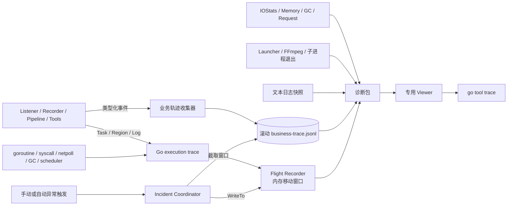
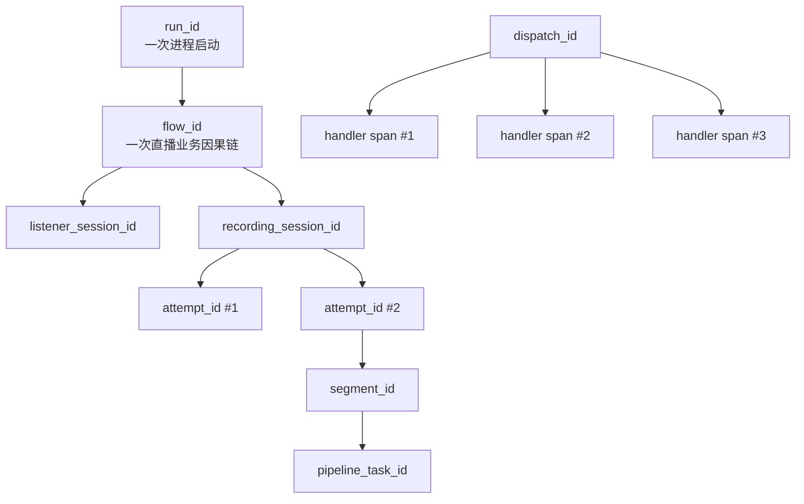
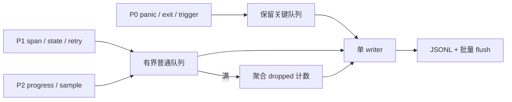
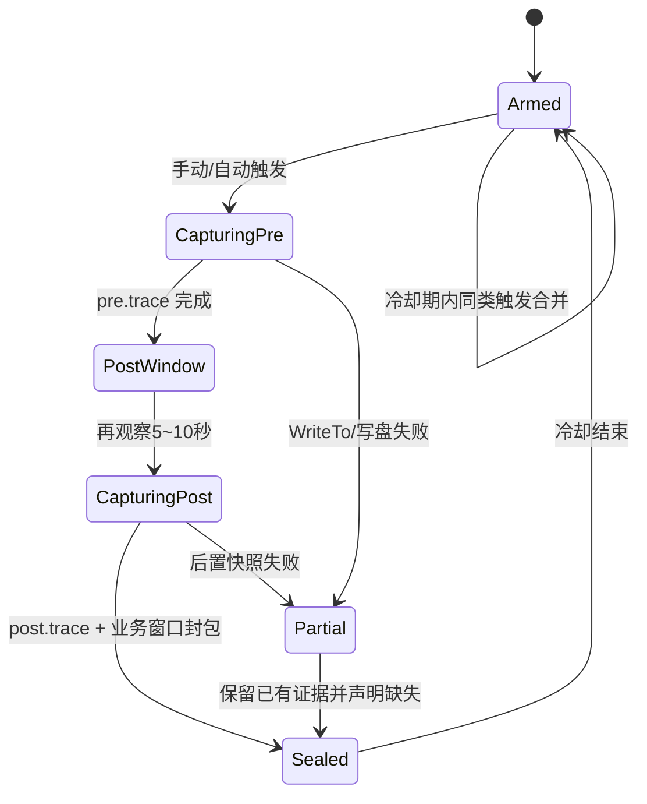
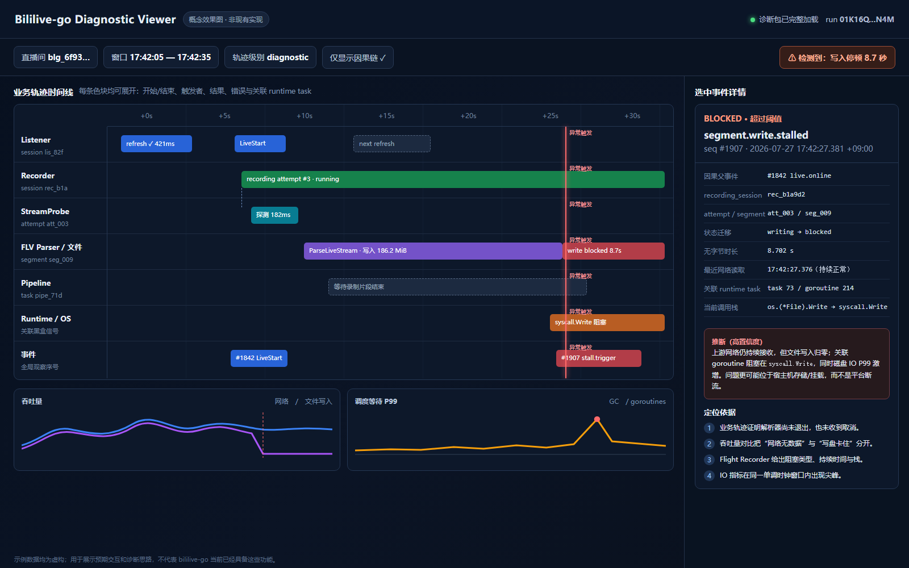
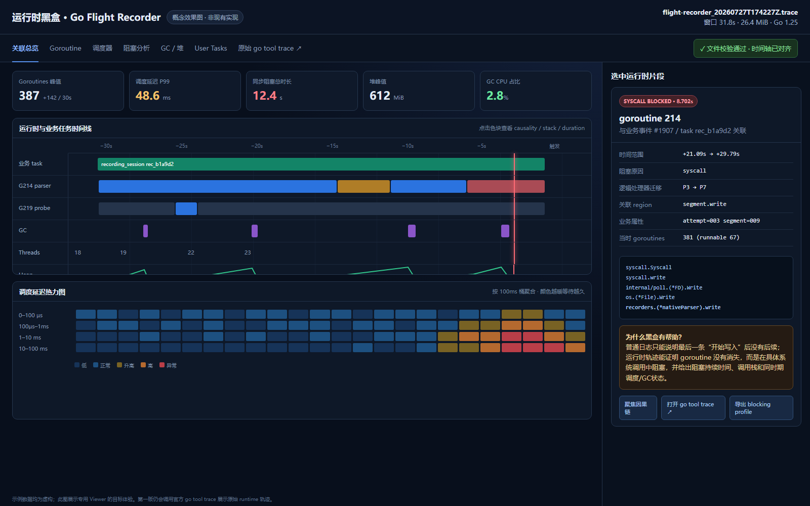
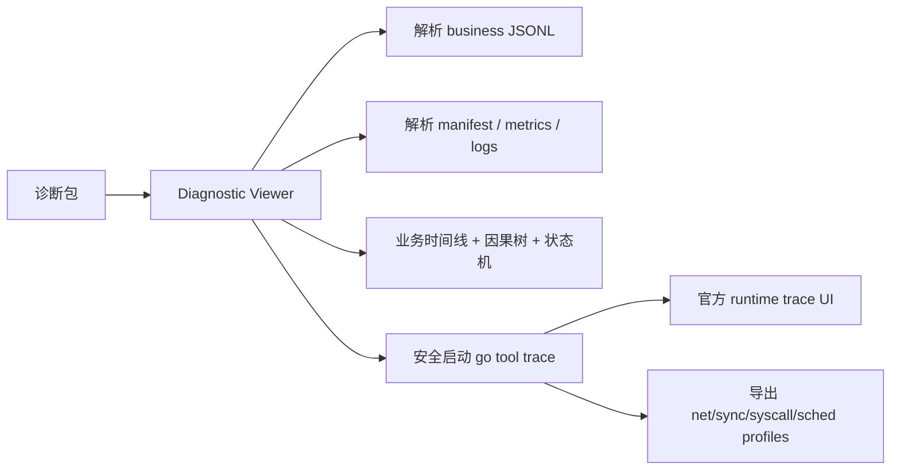
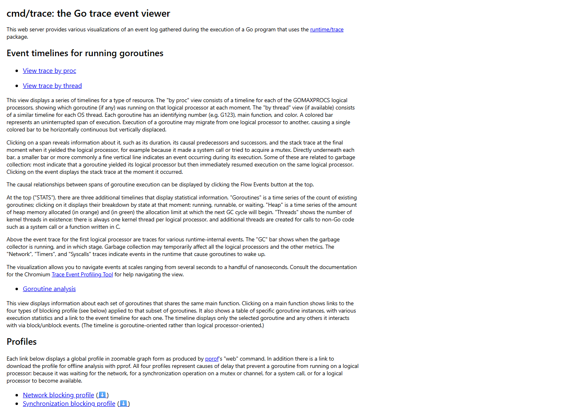
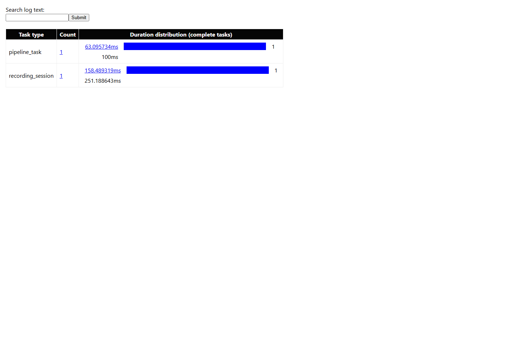

# 结构化业务轨迹与 Go Flight Recorder

> **状态（2026-07-30）**：第一版已经接入。每次运行使用独立目录保存分段 JSONL、
> heartbeat、clean/panic marker 和周期性 Go Flight Recorder；WebUI 可列出历史
> 运行、识别上一次疑似异常退出、冻结并下载调查包。本文后半的 Phase 列表仍保留为
> 后续演进路线，而不是“尚未开始”的状态。  
> **基线**：bililive-go `c0c7ecf`，`go.mod` 为 Go 1.25。  
> **前置阅读**：[《bililive-go 异步生命周期导览》](async-lifecycle.md)。

当前持久化布局：

```text
AppDataPath/diagnostics/
├── runs/<run_id>/
│   ├── run.json
│   ├── heartbeat.json
│   ├── lease.json + lease.lock    # 多进程存活判定；异常退出时内核释放锁
│   ├── events/events-000001.jsonl
│   ├── flight/flight-v1-000001.trace
│   ├── clean.json                 # 仅统一关闭完成后存在
│   ├── panic.json + panic.stack   # 捕获到 panic 时存在
│   └── acknowledged.json          # 用户确认提示；不会删除证据
└── exports/                       # HTTP 下载使用的一次性稳定副本
```

重启只会创建新的 `run_id`。旧运行没有 `clean.json` 时会被标记为“疑似未正常
结束”，原事件和 Flight 快照不会被新运行覆盖；ACK 只新增确认标记，不删除证据。

## 0. 先说结论

建议不要把所有诊断需求都塞进更详细的普通日志，而是保留三种互补证据：

| 证据 | 回答的问题 | 保存方式 | 典型保留范围 |
|---|---|---|---|
| 人类日志 | “发生了什么值得人读的事情？” | 普通滚动文本日志 | 较长 |
| **结构化业务轨迹** | “程序认为自己在执行哪个对象的哪一步？谁触发了谁？” | 独立滚动 JSONL | 分钟到天，按模式决定 |
| **Go Flight Recorder** | “Go runtime 当时怎样调度？goroutine 在哪里阻塞？” | 内存移动窗口，异常时导出 `.trace` | 最近数秒到数十秒 |

再把现有 IOStats、内存、GC、请求与子进程退出信息一起装进诊断包：



二者的分工应当非常明确：

- 业务轨迹知道 `room/recording_session/attempt/pipeline_task`；
- Flight Recorder 知道 `goroutine/P/M/syscall/netpoll/GC/stack`；
- 共享 ID 和时钟同步点把两条证据关联起来。

> **重要限制**：并发程序不存在一个可低成本记录的“唯一绝对总执行顺序”。全局 `seq` 只能表示轨迹 writer **观察到**的顺序；真正可信的是对象版本、父子关系、派发/处理关系、取消/唤醒关系等因果边。

---

## 1. 为什么不能只增加普通 debug log

继续增加文本日志当然有用，但无法独立解决以下问题：

1. 多 goroutine 日志到达 writer 的顺序，不等于发生顺序；
2. `LiveStart` 没有说明是哪个 listener generation、哪个 dispatch 和哪个 handler；
3. “开始录制”没有区分 controller start、attempt start、parser start 和 first byte；
4. 最后一条日志之后没有内容，无法区分：
   - goroutine已经退出；
   - goroutine仍在 network wait；
   - 阻塞在 mutex/channel；
   - 卡在系统调用；
   - 外部 FFmpeg不退出；
   - 任务发生 panic 后被 Recover吞掉；
5. `SIGKILL`/OOM时不可能依赖最后一条 defer 日志。

所以本方案不会引入“超级 DEBUG”来记录所有细节，而是：

- 文本日志继续面向人类；
- 业务轨迹使用固定 schema、ID、状态迁移和丢失声明；
- 高开销细节用有 TTL 的诊断模式；
- runtime层交给 Go Flight Recorder，而不是自己打印 goroutine调度日志。

---

## 2. 结构化业务轨迹模型

### 2.1 一条事件的建议 Schema

```json
{
  "schema": "bililive.business-trace/v1",
  "seq": 18422,
  "event_id": "evt_01K16QY7QHZ5X8YV6JQ9F5AB3P",
  "run_id": "run_01K16QQM9M7ZP8RNNG7KJH3N4M",
  "wall_time": "2026-07-27T17:42:27.381234567+09:00",
  "mono_ns": 348029190121,
  "severity": "warn",
  "kind": "span.end",
  "name": "recorder.stream_attempt",
  "component": "recorder",

  "flow_id": "flow_01K16QV2QHQV0A30AKS20Y53R8",
  "span_id": "span_01K16QY7QQA31PYY1QB6CKDBCE",
  "parent_span_id": "span_01K16QV2QRNK0M93W1FF1FK10Q",
  "dispatch_id": "dispatch_01K16QV2QMP8ZDADMW9DKFQJHN",

  "entity": {
    "type": "recording_attempt",
    "id": "att_003",
    "revision": 12,
    "generation": 4
  },

  "links": [
    {
      "rel": "caused_by",
      "event_id": "evt_01K16QV2QFQ5VP7X25J7RYQ7V5"
    },
    {
      "rel": "retries",
      "span_id": "span_01K16QQV6PZJWA3PCAW06NPW7M"
    }
  ],

  "state": {
    "from": "reading",
    "to": "retry_wait"
  },

  "outcome": {
    "status": "timeout",
    "code": "stream.no_progress",
    "retryable": true,
    "duration_ms": 30004
  },

  "attrs": {
    "attempt_no": 4,
    "bytes_read": 0,
    "last_progress_age_ms": 30001
  }
}
```

字段按用途分组：

| 字段 | 用途 |
|---|---|
| `schema` | 允许 Viewer做版本兼容 |
| `seq` | 单个 writer 的观察顺序；不是并发全序 |
| `event_id` | 精确引用一条事件 |
| `run_id` | 一次进程运行；每次启动必须变化 |
| `wall_time` | 人类阅读、跨进程粗对齐 |
| `mono_ns` | 进程内持续时间与排序，不受系统时间跳变影响 |
| `kind/name/component` | 低基数事件类别 |
| `flow_id` | 一条较长业务因果链，如开播→录制→Pipeline |
| `span_id/parent_span_id` | 有起止操作的父子关系 |
| `dispatch_id` | 一次事件派发及全部 handler 的共同 ID |
| `entity.id/revision/generation` | 同一对象的身份、状态版本和替换代次 |
| `links` | `caused_by/retries/cancels/supersedes/wakes` 等非树形因果边 |
| `state` | 明确记录状态迁移 |
| `outcome` | 稳定错误码、是否可重试、耗时 |
| `attrs` | 经过白名单的额外数值/枚举 |

本目录附带一份可直接检查的
[合成业务轨迹 JSONL](assets/business-trace-synthetic.jsonl)。它依次展示：

```text
offline → live
  → Dispatch LiveStart
  → RecorderManager handler
  → recording session / attempt #3
  → segment first byte / progress
  → 文件无进展但网络仍有进展
  → diagnostic.trigger
  → clock sync
  → Flight Recorder pre snapshot
```

该文件只用于评审 Schema 与 Viewer，不是当前 bililive-go 的真实输出。

### 2.2 ID 的生命周期



建议的领域 ID：

- `listener_session_id`
- `live_observation_id`
- `recording_session_id`
- `attempt_id`
- `segment_id`
- `pipeline_task_id` + `pipeline_attempt_id`
- `process_instance_id`（FFmpeg、klive、OpenList 等）
- `incident_id`

对于 Launcher 与 child：

- 两个进程各有自己的 `run_id` 和本地 `seq`；
- IPC message携带 `message_id`；
- sender记录 `ipc.send`，receiver记录 `ipc.receive`；
- Viewer用 message ID建立跨进程因果边，而不是假定两台时钟完全一致。

### 2.3 `kind` 应保持少量固定枚举

- `instant`
- `span.start`
- `span.end`
- `state.transition`
- `counter`
- `trace.loss`

不应把 room ID、错误文本或任务 ID拼进 name：

```text
正确：name = "recorder.attempt.start", attrs.attempt_no = 3
错误：name = "recorder-room-123-attempt-3-start"
```

低基数命名既便于聚合，也避免 runtime trace 的 annotation元数据膨胀。

---

## 3. 第一批应覆盖的生命周期事件

### 3.1 进程与 owner

```text
process.run.start
process.ready
process.shutdown.requested
process.shutdown.phase.start/end
process.run.end
owner.task.start
owner.task.cancel.requested
owner.task.cancel.observed
owner.task.exit
owner.task.exit_unexpectedly
```

每个长期任务都应回答：

- 谁创建了我？
- 我使用哪个 ctx？
- 我何时观察到 cancel？
- 我是否正常退出？
- owner退出时我是否仍存活？

### 3.2 EventDispatcher

```text
event.dispatch
event.handler.start
event.handler.end
event.handler.panic
event.dispatch.complete
event.dispatch.abandoned
```

必须记录：

- `dispatch_id`
- event type、不可变 payload摘要
- handler index/name
- enqueue→start 的 queue delay
- handler持续时间与结果
- panic 后哪些 handler未执行
- shutdown 时是否仍有 in-flight dispatch

这可以直接解释“代码先派了 A 再派 B，但 B 的副作用先发生”。

### 3.3 Live / Listener

```text
live.initialize.attempt.start/end
live.identity.replaced
live.refresh.start/end
live.state.transition
listener.start.requested/accepted
listener.close.requested/accepted/ignored
listener.run.start/end
```

关键字段：

- temporary/final live ID的诊断哈希；
- `generation`；
- 初始化底层 error，即使对上层被转换成 `Initializing=true`；
- 状态转换前后值；
- close被忽略时的当前状态；
- refresh来源（scheduler、manual、listener）。

### 3.4 Recorder / Stream / Segment

```text
recorder.session.start/end
recorder.attempt.start/end
recorder.retry.scheduled
stream.resolve.start/end
stream.select
stream.connect.start/end
stream.progress
stream.stalled
parser.start/stop.requested/exit
segment.open/first_byte/progress/close
danmaku.session.start/end
```

`RecorderStart` 不再承担“正在录制”的全部含义。Viewer应分别显示：

```text
controller存在 → 获取流 → probe → parser启动 → 首字节 → 持续写入 → stop请求 → 文件收尾 → Pipeline入队 → run退出
```

高频 `stream.progress/segment.progress` 必须聚合，例如：

- 每 5 秒最多一条；
- 状态或速率区间显著变化时额外一条；
- 不按每个网络包/文件块记录。

### 3.5 Pipeline

```text
pipeline.task.enqueued/start/end
pipeline.attempt.start/end
pipeline.stage.start/end
pipeline.parallel_branch.start/end
pipeline.task.cancel.requested/observed
```

新增 attempt后才能区分：

- 第一次运行；
- crash恢复后的整条重跑；
- 用户手动 retry；
- 某个非幂等 stage是否已产生副作用。

### 3.6 外部进程

```text
subprocess.start
subprocess.ready
subprocess.stdin.quit
subprocess.signal
subprocess.kill
subprocess.exit
```

白名单字段至少包括：

- process kind、诊断 ID、PID；
- 创建它的业务 span；
- start/end单调时间；
- exit code、signal；
- stop cause（root cancel、segment end、timeout、manual、update）；
- 是否先尝试 `q`，何时升级到 kill；
- 限长、脱敏后的 stderr摘要或稳定 fingerprint。

---

## 4. 文件、级别与背压

### 4.1 不要把“轨迹详细度”混成日志严重级别

建议设置独立的诊断模式：

| 模式 | 业务轨迹 | Flight Recorder | 用途 |
|---|---|---|---|
| `normal` | 状态迁移、错误、任务起止、低频摘要 | 小窗口，若资源允许默认 armed | 长期运行 |
| `debug` | 增加每次请求、attempt、handler耗时 | 平衡窗口 | 维护者主动排查 |
| `diagnostic` | 增加细粒度 span与较密资源采样 | 临时扩大窗口 | 用户复现，自动过期 |

`diagnostic` 必须有：

- 明确 TTL，例如 15/30/60 分钟；
- 到期自动恢复；
- 预计额外磁盘/内存提示；
- 一键“刚刚出问题”快照；
- 不因用户忘记关闭而长期高开销运行。

### 4.2 文件建议

```text
logs/
  bililive.log
diagnostics/
  business-trace.current.jsonl
  business-trace.20260727T170000Z-001.jsonl
  incidents/
    inc_01K16Q.../
```

业务轨迹与普通日志分开：

- JSONL每行独立解析；
- 按大小+时间轮转；
- 当前文件下载时先 flush，再复制/硬链接到临时只读快照；
- 下载快照有固定长度和 SHA-256；
- 不直接把仍增长的文件句柄暴露给 HTTP；
- 旧文件受总容量与保留期双重限制。

### 4.3 Writer 与优先级

诊断系统本身不能成为新的死锁源：



优先级：

| 优先级 | 内容 | 队列紧张时 |
|---|---|---|
| P0 | panic、异常退出、诊断触发、关键终态 | 保留容量并尽最大努力同步到应急环；仍不承诺抗SIGKILL |
| P1 | span起止、取消、重试、真实状态迁移 | 尽量保留 |
| P2 | 周期进度、详细采样 | 先采样/合并/丢弃 |

任何丢失都必须生成可见的 `diagnostic.trace.loss`：

```json
{
  "kind": "trace.loss",
  "name": "diagnostic.trace.loss",
  "attrs": {
    "reason": "queue_full",
    "dropped": 1842,
    "first_mono_ns": 348000000000,
    "last_mono_ns": 348200000000,
    "components": ["recorder", "sse"]
  }
}
```

如果连 loss事件也写不进去，manifest仍要从独立原子计数器读取并显示“轨迹不完整”。绝不能像当前 SSE丢包一样静默。

### 4.4 “全局顺序”的正确说法

- `seq` 是集中 writer接收顺序；
- `mono_ns` 是本进程单调时钟；
- `entity.revision` 给出同一对象的状态版本；
- `parent_span_id` 和 `links` 给出因果；
- `dispatch_id + handler_index` 还原派发扇出；
- runtime trace 的 flow给出 goroutine阻塞/唤醒；
- 不宣称一个 JSONL顺序就是所有 CPU上的绝对执行顺序。

---

## 5. 隐私与脱敏

必须采用**源头字段白名单**，不能先把所有内容写入，再指望上传时用黑名单清洗。

禁止进入业务轨迹和 `trace.Log`：

- Cookie、Token、密码、SMTP授权码；
- 代理认证；
- 完整直播流 URL/query；
- HTTP header/body；
- 用户名、房间标题等自由文本；
- 完整本地文件路径；
- 完整命令行、环境变量；
- 未清洗的 `err.Error()`。

建议：

- room/user/file使用诊断包级随机盐 HMAC；
- 同一包内可关联，不同包之间默认不可关联；
- 错误用稳定 `code + class + fingerprint`；
- 文件只保留扩展名、大小、所在存储类别，除非用户明确选择包含路径；
- config只生成字段白名单摘要，不能直接序列化完整 Config；
- manifest记录脱敏规则版本与被删除字段。

原始 `.trace` 仍可能包含：

- 编译时源码路径；
- 函数名、调用栈；
- 程序主动写入 annotation 的原文。

二进制 trace 很难在上传前可靠二次脱敏，所以最重要的防线是：**不要把秘密写入 `trace.Log`**。上传前必须明确告知用户 `.trace` 含上述技术元数据。

---

## 6. Go Flight Recorder 的准确能力

本项目为 Go 1.25，可使用 `runtime/trace.FlightRecorder`。官方 API：

```go
func NewFlightRecorder(cfg FlightRecorderConfig) *FlightRecorder
func (fr *FlightRecorder) Start() error
func (fr *FlightRecorder) Enabled() bool
func (fr *FlightRecorder) WriteTo(w io.Writer) (int64, error)
func (fr *FlightRecorder) Stop()
```

配置只有：

```go
type FlightRecorderConfig struct {
    MinAge   time.Duration
    MaxBytes uint64
}
```

已确认的语义：

- 同一进程最多一个 active Flight Recorder；
- 它可与一个普通 `trace.Start` consumer共存；
- 同一时刻只能有一个 `WriteTo`；
- 并发 `WriteTo` 直接报错，不会自动合并；
- `Stop` 会等待正在进行的 `WriteTo`；
- `WriteTo` 后可以让 recorder继续运行；
- 快照预计接近调用时最新状态，但不是硬保证；
- `MaxBytes` 优先于 `MinAge`；
- `MaxBytes` 是上限提示，不严格保证输出文件或内存绝不超出；
- `MinAge` 是希望至少保留的年龄，结果可能更旧，也可能因 MaxBytes优先而更短；
- 不能依赖零值对应的内部默认数值。

官方资料：

- [Go Flight Recorder 官方介绍](https://go.dev/blog/flight-recorder)
- [`runtime/trace` API](https://pkg.go.dev/runtime/trace)
- [`go tool trace` 命令](https://pkg.go.dev/cmd/trace)
- [Go Diagnostics：execution tracer 的适用范围](https://go.dev/doc/diagnostics#execution-tracer)
- [Go 1.25 发布说明](https://go.dev/doc/go1.25#Trace_flight_recorder)

### 6.1 它自动记录什么

- goroutine创建、退出及 running/runnable/waiting状态；
- block/unblock与唤醒关系；
- network wait；
- mutex、channel等同步阻塞；
- syscall进入、退出与阻塞；
- logical processor和OS thread活动；
- GC阶段；
- heap已分配值与下一次GC目标；
- 大多数事件的纳秒级时间戳和调用栈；
-用户 Task、Region、Log；
- 已经启用CPU profile时，尽力包含CPU样本。

### 6.2 它不会自动告诉我们什么

- 这是哪个直播间、第几次录制重试；
- channel中传递了什么业务对象；
- 任意内存读写的完整顺序；
- FFmpeg等子进程内部发生了什么；
- Cookie、网络报文或配置内容；
- SIGKILL/OOM/断电后再补做快照；
- CPU和堆热点的完整根因。

execution trace最擅长延迟、调度和并行度问题。CPU热点仍应使用 CPU profile，对象分配/存活仍应使用 heap profile。

### 6.3 初始容量档位：只作为实验值

官方文章建议 `MinAge` 可从目标观察窗口约两倍开始调试，同时提醒繁忙服务轨迹可能达到数 MiB/s，甚至约 10 MiB/s。必须在：

- 空闲；
- 1、10、50个监听房间；
- 1、5、10路并发录制；
- Pipeline并行处理；
- 小内存 NAS；

这些场景中实测生成速率、CPU和RSS。

| 候选档位 | `MinAge` | `MaxBytes` | 用途 |
|---|---:|---:|---|
| 低内存 | 10 秒 | 16 MiB | 小 NAS/路由器 |
| 平衡 | 20 秒 | 64 MiB | 一般长期运行 |
| 临时诊断 | 30 秒 | 128 MiB | 用户主动开启并自动过期 |

这些值**不承诺实际保留时长**。Viewer必须读取并显示快照的实际覆盖范围。

---

## 7. 用用户标注把 runtime 与业务关联

不要把每条 JSON事件复制一份到 runtime trace，只标注关键边界。

### 7.1 `trace.NewTask`

适合跨 goroutine 的逻辑任务：

- `recording.session`
- `recording.attempt`
- `pipeline.task`
- `event.dispatch`
- `process.shutdown`

Task通过 context跨 goroutine传播，可以形成父子任务和时长分布。

### 7.2 `trace.StartRegion` / `trace.WithRegion`

适合同一 goroutine中的同步区间：

- `live.refresh`
- `stream.resolve`
- `stream.probe`
- `segment.finalize`
- `pipeline.stage`

Region必须在创建它的同一个 goroutine结束，并且正确嵌套；不能把一个 Region跨 goroutine Begin/End。

### 7.3 `trace.Log`

只记录短小、安全、低基数的关联信息：

```text
category: bililive.link
message:  flow=F3 span=S8

category: bililive.state
message:  connecting

category: bililive.outcome
message:  timeout
```

不能写完整 URL、路径、房间标题、原始 error或配置。

### 7.4 时钟同步

每隔数秒，以及每次 incident触发时，两条轨迹同时生成：

```text
diagnostic.clock_sync(sync_id)
```

- JSON记录 `sync_id + mono_ns + wall_time + seq`；
- runtime trace通过 `trace.Log` 记录同一 `sync_id`；
- Viewer找到共同标记后对齐时间轴；
- 找不到共同标记时分开显示，不能靠猜测强行叠加。

---

## 8. 触发与快照生命周期



建议触发源：

| 触发器 | 能捕捉的典型问题 |
|---|---|
| WebUI“刚刚出问题” | 用户看到页面异常、卡住、没录制 |
| panic/recover wrapper | goroutine panic前的调度与业务因果 |
| 录制长期无字节 | 网络等待、写盘阻塞、parser/FFmpeg卡住 |
| 非法状态迁移 | 乱序事件、旧 generation迟到 |
| start长时间无 end | goroutine泄漏、stage不响应取消 |
| FFmpeg异常退出 | Go调用方上下文 + 子进程退出证据 |
| shutdown超时 | 哪个任务、锁、syscall阻止结束 |
| goroutine持续增长 | 未关闭 scheduler/timer/danmaku |
| 内存/GC压力异常 | 分配/GC与业务任务时间关联 |
| Launcher检测异常退出 | child结束前窗口；若child没快照则保留parent证据 |

Snapshot Coordinator必须：

- 串行化 `WriteTo`；
- 把相近触发合并进同一 `incident_id`；
- 记录所有 trigger reason，而不是覆盖第一个；
- 实施同原因 cooldown；
- 限制每小时/每天次数与总字节；
- 检查剩余磁盘和内存压力；
- 直接把 `WriteTo` 写到文件，避免先放入等量 `bytes.Buffer`；
- 写 `.partial`，close并校验后原子 rename；
- 使用仅当前用户可读的权限；
- 即使部分步骤失败，也生成 manifest说明已有/缺失证据。

`SIGKILL`、内核OOM kill、断电时进程没有机会调用 `WriteTo`。这时应依赖：

- 启动时创建的 `run.open` marker；
- 优雅退出时才写的 `run.closed` marker；
- Launcher/container记录的 exit code/signal/OOM状态；
- 触发前已落盘的业务轨迹与指标；
- parent launcher自己的 Flight Recorder（若采用双进程方案）。

“没有 `.trace`”绝不等于“没有崩溃”。

---

## 9. 诊断包

建议格式：

```text
manifest.json
business/
  business-trace.jsonl
runtime/
  flight-pre-go1.25.trace
  flight-post-go1.25.trace
logs/
  current-log.snapshot
  previous-log.snapshot
crash/
  panic.json
  launcher-exit.json
system/
  runtime-metrics.json
  process-tree.json
  cgroup-summary.json
config/
  config-summary.redacted.json
checksums.sha256
```

### 9.1 `manifest.json` 最低要求

- schema version；
- 应用版本、commit、Go版本、OS/arch；
- `run_id`、`incident_id`；
- 触发时间、所有原因与阈值；
- 业务轨迹实际 seq/time范围；
- dropped事件统计；
- Flight Recorder配置与实际覆盖范围；
- 每个文件大小和SHA-256；
- pre/post快照失败信息；
- CPU samples是否存在；
- 脱敏规则版本和已删除字段清单；
- clean/crash/forced-kill/unknown分类及证据。

### 9.2 当前增长日志的安全下载

用户最初提出的“复制当前日志再下载”已经由
`GET /api/diagnostics/logs/download` 的第一版 Snapshot Service 实现。当前流程是：

1. 请求进入后检查权限、并发数和预计大小；
2. 通知日志 writer flush；
3. 对最近 3 个 bililive-go 日志固定首次 `stat` 的长度，并各取最后 8 MiB；
4. 复制到权限为 `0600` 的临时 tar.gz，close 并 fsync；
5. 下载只读快照，不直接流式读取仍增长的源文件；
6. 下载完成或TTL到期后删除；
7. 容量不足或复制失败时返回明确错误；
8. manifest标出源大小、实际包含字节数和头部是否截断，快照边界以记录的字节数为准。

尚未实现的增强项是归档级 SHA-256 清单和 TTL 后台清理；正常 HTTP 响应完成时会立即
删除临时导出文件，异常中断留下的文件由后续清理策略处理。

---

## 10. 专用 Viewer：目标体验

本章最初的图片是目标概念图。随后实现的第一版浏览器原型如下：


原型已经支持浏览器本地打开 JSON bundle、自动关键路径分析、瀑布图、泳道、指标、
原始事件、JSON/ZIP/tar.gz 本地导入和手机布局；原始 Go `.trace` 仍需交给
`go tool trace`，React 页面尚不解析它。运行方式与测试包见
[《诊断轨迹 WebUI 原型》](diagnostic-viewer-webui.md)。

### 10.1 业务时间线概念图

下图是**设计效果图，数据均为虚构，当前项目尚未实现**：



它展示一个“文件写入停顿”的例子：

- Listener、Recorder、Probe、Parser、Pipeline各占一条 lane；
- 选中事件保留 `seq`、父事件、session/attempt/segment；
- 网络读取仍正常，而文件写入归零；
- 同一时刻 runtime goroutine阻塞在 `syscall.Write`；
- 磁盘 IO P99同步升高；
- Viewer因此把“上游断流”和“宿主机存储阻塞”分开。

### 10.2 运行时黑盒概念图

下图同样是**设计效果图**：



预期指标：

| 区域 | 可以看到 | 用于判断 |
|---|---|---|
| Goroutine | 峰值、running/runnable/waiting、创建函数分组 | 泄漏、任务悄然退出、调度饥饿 |
| Scheduler | runnable延迟、P利用、阻塞/唤醒 flow | CPU资源不足、锁竞争、唤醒链缺失 |
| Blocking | net/sync/syscall/sched时长和栈 | 网络等待、mutex/channel、系统调用卡住 |
| Heap/GC | heap alloc、next GC goal、GC阶段、MMU | GC压力是否与卡顿同时发生 |
| Threads | OS thread数量、syscall占用 | thread增长、长系统调用 |
| User Tasks | 业务 Task完成/未完成、时长分布 | 哪类录制或Pipeline任务异常变慢 |
| 关联详情 | flow/span、业务事件、goroutine、调用栈 | 从“哪次录制”跳到“哪段runtime执行” |

### 10.3 Viewer V1 架构

Go 1.25标准库没有稳定公开的二进制 trace Reader。第一版不应重写 Go runtime trace解析与渲染：



V1：

- 自己解析 JSONL、manifest、metrics和普通日志；
- 提供统一业务时间线、因果树、状态机检查和轨迹完整性；
- runtime页面提供“在 `go tool trace` 中打开”；
- 自动导出四种 pprof；
- 使用共同 `sync_id` 告诉用户应聚焦的 runtime时间范围。

V2可以评估 [`golang.org/x/exp/trace.Reader`](https://pkg.go.dev/golang.org/x/exp/trace)，但它仍是实验 API。若采用：

- 固定版本；
- 隔离在 adapter；
- 对 Go 1.25/1.26建立 golden trace；
- 永远保留原始 `.trace`；
- 解析失败自动回退到 `go tool trace`。

---

## 11. 实际 `go tool trace` 会看到什么

运行：

```bash
go tool trace snapshot.trace
```

官方入口页提供：

- 按 logical processor 查看时间线；
- 按 OS thread 查看时间线；
- Goroutine analysis；
- Network blocking profile；
- Synchronization blocking profile；
- Syscall profile；
- Scheduler latency profile；
- User-defined tasks/regions；
- Minimum Mutator Utilization。



时间线顶部 STATS 可看到：

- Goroutines总量与 running/runnable/waiting；
- Heap已分配值与下一次GC目标；
- OS threads；
- GC、Network、Timers、Syscalls；
- goroutine执行区间、flow和阻塞时调用栈。

### 11.1 User Tasks 的真实示例

为验证展示效果，本目录附带一份**独立合成程序产生的演示 trace**，并非 bililive-go 当前实现：

- [下载/打开演示 `.trace`](assets/bililive-go-flight-demo.trace)
- 包含 `recording_session` 与 `pipeline_task` 两种 User Task；
- 包含 `get_stream_info`、`stream_probe`、`parse_live_stream`、`convert_mp4` 等 Region；
- 包含网络等待、GC与用户 Log；
- 示例任务很短，只用于证明标注和 Viewer形态。

```bash
go tool trace docs/architecture/assets/bililive-go-flight-demo.trace
```

User Tasks 页面会聚合同类 Task的数量与时长分布：



实际 bililive-go 加入标注后，维护者可从“所有 `recording_session` 的时长分布”进入某个异常 task，再聚焦它涉及的 goroutine、Region、Log和runtime事件。

### 11.2 四种阻塞 profile

```bash
go tool trace -pprof=net snapshot.trace > net.pprof
go tool trace -pprof=sync snapshot.trace > sync.pprof
go tool trace -pprof=syscall snapshot.trace > syscall.pprof
go tool trace -pprof=sched snapshot.trace > sched.pprof
```

| Profile | 主要问题 |
|---|---|
| `net` | socket读取、连接等网络等待 |
| `sync` | mutex、channel等同步阻塞 |
| `syscall` | 系统调用占用/阻塞 |
| `sched` | runnable到真正获得P执行的延迟 |

原生时间线目前更适合用 Chrome/Chromium打开。`.trace`越大，Viewer解析所需内存也越高，因此必须控制快照大小。

---

## 12. 如何用两条轨迹定位问题

### 12.1 “录制卡死”，日志没有错误

业务轨迹：

```text
T=-31s recorder.attempt.start
T=-30s stream.connect.end: ok
T=-29s segment.open
T=  0s stream.stalled: 30s无字节
```

Flight Recorder进一步区分：

| runtime证据 | 更可能的方向 |
|---|---|
| goroutine长期 network wait | 远端、代理或网络读取 |
| 阻塞在 `os.File.Write/syscall.Write` | 磁盘、挂载、文件系统 |
| 阻塞在 mutex/channel | Go侧锁竞争、消费者未唤醒 |
| 长期 runnable但未运行 | 调度延迟、宿主CPU配额/过载 |
| Go goroutine在 `Cmd.Wait`，其余健康 | 进一步调查 FFmpeg子进程 |

### 12.2 `LiveEnd` 与 Recorder Restart 相交

业务 Viewer可以显示：

```text
Dispatch D81 RoomNameChanged
  handler RecorderManager: recording → restarting
Dispatch D82 LiveEnd
  handler RecorderManager: restarting → stopping
D81 的迟到结果:
  stopping → recording  [generation过期/非法转换]
```

runtime task再证明两个 handler确实重叠，以及旧 handler何时被唤醒。这样能定位到缺少 generation guard、取消检查或串行化的具体边界，而不是猜“可能是网络波动”。

### 12.3 Pipeline/FFmpeg不结束

- 业务轨迹有 `pipeline.stage.start`，迟迟没有 end；
- 若 goroutine在 `Cmd.Wait`，Go runtime健康：重点在外部进程；
- 若阻塞在 stdout/stderr drain channel：sync/syscall profile可定位Go侧反压；
- 子进程事件若已有 exit code/signal：可确认是 child退出，不是Go panic；
- Flight Recorder看不到FFmpeg内部栈，因此仍需有限stderr与FFmpeg自身报告。

### 12.4 Goroutine或内存持续增长

业务轨迹先查：

- 同类 `owner.task.start` 是否缺少 end；
- 哪个 generation反复创建 scheduler、timer、danmaku；
- Close是否 accepted，cancel是否 observed。

Goroutine analysis再按启动函数分组看实例数与阻塞类型。Heap/GC时间线能确认增长是否伴随GC压力，但“哪些对象占内存”仍需要 heap profile，不能仅靠 Flight Recorder下结论。

### 12.5 用户说崩溃，但 Sentry没有记录

Viewer按证据分类：

| 证据 | 结论 |
|---|---|
| `panic.json` + `pre.trace` | 捕获到Go panic |
| Launcher记录非零 exit code/signal | 子进程异常退出 |
| container/cgroup记录 OOM | 内核OOM kill |
| `run.open`存在、`run.closed`缺失、轨迹突然中断且无快照 | 强制终止、断电或OOM等；进程没有机会快照 |
| Sentry和Flight Recorder都无文件 | 证据不足，**不能**推出“没有崩溃” |

---

## 13. 性能与可靠性验收

实现不能只验证“能生成文件”，还要证明检测系统没有制造新问题。

### 13.1 基准矩阵

| 负载 | normal | debug | diagnostic |
|---|---:|---:|---:|
| 空闲100个房间 | CPU/RSS/trace rate | 同左 | 同左 |
| 10路监听刷新 | P50/P99 | P50/P99 | P50/P99 |
| 1/5/10路录制 | 写入吞吐、丢事件 | 同左 | 同左 |
| Pipeline并发 | stage时延、关闭时长 | 同左 | 同左 |
| 小内存容器 | OOM风险、实际窗口 | 同左 | 同左 |

建议验收项：

- normal模式CPU/RSS增量有明确预算；
- 业务关键路径不因队列满而无限阻塞；
- snapshot写盘失败不会使主程序panic；
- 高负载时会生成可见 `trace.loss`；
- `WriteTo`并发触发被合并，不会竞争；
- 磁盘配额与保留期生效；
- 当前增长日志下载得到固定字节快照；
- `go tool trace` 能打开每个受支持Go版本的golden文件；
- 模拟SIGTERM、panic、child非零退出、磁盘满、只读目录、低内存；
- race detector覆盖 writer、ID传播和snapshot coordinator；
- secrets corpus验证 Cookie/Token/URL/query/路径不会进入任何包。

### 13.2 故障注入场景

应构造：

- Listener初始化时立即在线；
- `LiveStart/LiveEnd/LiveStart` 人工乱序；
- Event handler panic；
- parser网络Read永久阻塞；
- 文件写入阻塞或ENOSPC；
- FFmpeg不响应 `q`；
- Pipeline stage不响应ctx；
- SSE慢客户端；
- business trace队列满；
- Flight Recorder `WriteTo`目标磁盘满；
- Launcher IPC shutdown；
- child SIGKILL和容器OOM。

每个场景的验收标准不是“程序一定自愈”，而是诊断包能明确回答：

1. 最后一个可信状态是什么；
2. 哪个对象/generation仍有 owner；
3. cancel是否发出并被观察；
4. 哪个 handler或子进程未结束；
5. 轨迹是否完整；缺失了多少；
6. 结论是事实、推断还是证据不足。

---

## 14. 分阶段实施建议

### Phase 0：先统一术语和 ID

- 确定 schema与脱敏白名单；
- 生成 `run_id`；
- 为 Listener/Recorder/attempt/segment/Pipeline/子进程补稳定 ID；
- 定义错误码和状态机；
- 不改变现有业务调度语义。

### Phase 1：低风险业务轨迹

- 单 writer、滚动 JSONL、loss计数；
- 先覆盖 process、EventDispatcher、Listener、Recorder、Pipeline、subprocess边界；
- WebUI只做文件快照下载；
- 用 Viewer/脚本画业务因果，不引入runtime trace。

### Phase 2：Flight Recorder

- normal小窗口；
- Task/Region/Log低基数标注；
- 手动“刚刚出问题”；
- panic、stall、shutdown timeout自动触发；
- 生成manifest和pre/post trace。

### Phase 3：专用 Viewer V1

- 业务时间线、因果树、状态机、完整性；
- metrics/logs/manifest同屏；
- 调用官方 `go tool trace`；
- 自动生成四种pprof。

### Phase 4：自动检测与受控分享

- goroutine增长、非法状态迁移、child exit等更多触发；
- TTL诊断模式与自动容量策略；
- 经独立威胁模型审查后，再考虑上传；
- 上传服务、账号、限流、配额、加密和内容处置不应与首版轨迹耦合。

---

## 15. 实现前仍需做的产品决定

1. normal模式是否默认启动 Flight Recorder，最低支持内存是多少？
2. 三档容量是否由自动内存探测选择，用户能否覆盖？
3. 业务轨迹默认保留多久、总容量多少？
4. 哪些 P0事件允许进行有限同步落盘，最长可阻塞多久？
5. room ID在本地 Viewer中是否也默认HMAC？
6. 诊断包默认是否包含文件路径、房间标题和最后N行日志？
7. WebUI下载是否需要重新认证、一次性token和审计记录？
8. Viewer是独立桌面工具、本地Web服务，还是集成现有WebUI？
9. 是否为 Launcher也启用独立的小型 Flight Recorder？
10. 何时触发CPU/heap profile，如何避免与 Flight Recorder混淆？

在这些决定落定前，建议先实现 Phase 0/1的 schema原型与离线 Viewer原型，以真实样本验证“这些字段是否真的能解释现有竞态”，再改动核心生命周期。
